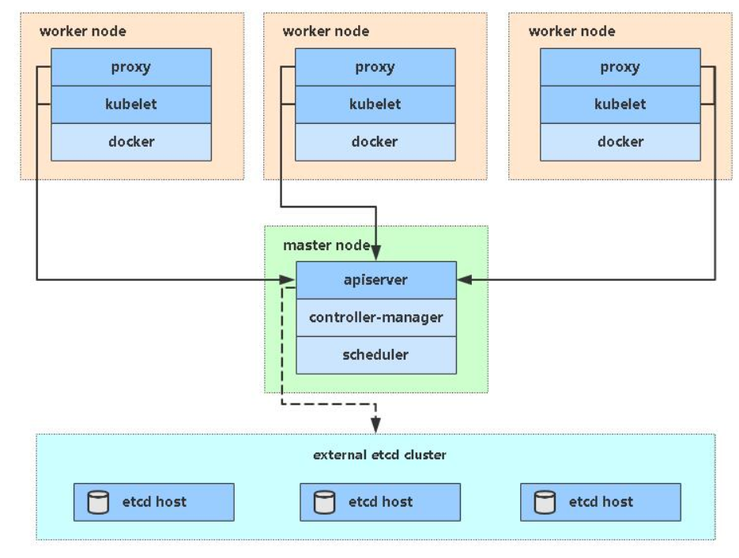

> 使用ansible快速部署Kubernetes 集群

集群版本: v1.18

## 一、安装ansible

```
yum -y install wget
wget -O /etc/yum.repos.d/epel.repo http://mirrors.aliyun.com/repo/epel-7.repo
yum -y install ansible
ansible --version
```

## 二、初始化机器

初始化机器,所有节点机器都需要做。其中主要做了以下几个动作
* 推送公钥(保证管理机能够和集群中的所有主机进行免密通信)
* 关闭防火墙
* 关闭selinux
* 关闭swap交换分区
* 设置时区和时间同步
* 设置主机名
* 设置hosts解析
* 重启服务器

执行如下命令，可对服务器进行初始化操作
```
ansible-playbook inits.yml -i hosts-init
```

注意: **如果k8s节点和etcd节点复用了,所以主机名都统一设置为k8s节点的主机名,如果没有复用就要配置一下主机名的条件**


## 三、部署工具配置文件修改

### 3.1、修改Ansible 文件

修改hosts 文件，根据规划修改对应IP和名称
```
vim hosts
...
```

修改group_vars/all.yml ，修改软件包目录和证书可信任IP
```
# vim group_vars/all.yml
software_dir: '/root/binary_pkg'
...
cert_hosts:
  k8s:
  etcd:
```

## 四、一键部署

### 4.1、架构图

单master架构


多master架构


### 3.2、部署命令

单master版本部署
```
ansible-playbook single-master-deploy.yml -i hosts
```

多master版本部署
```
ansible-playbook multi-master-deploy.yml -i hosts
```

## 五、部署控制

如果安装某个阶段失败，可针对性测试

例如: 只运行部署插件
```
ansible-playbook single-master-deploy.yml -i hosts --tags k8s-node
```

## 六、节点扩容

### 6.1、机器初始化

#### 6.1.1、修改hosts,添加新节点IP

```
vim hosts

[newnode]
```

#### 6.1.2、执行命令进行初始化

```
ansible-playbook inits-new.yml -i hosts-init
```

### 6.2、新增Kubernetes节点

#### 6.2.1、修改hosts,添加新节点IP

```
vim hosts
```

#### 6.2.2、执行部署

```
ansible-playbook -i hosts add-node.yml
```

#### 6.2.3、在Master节点允许颁发证书并加入集群

```
kubectl get csr
kubectl certificate approve node-csr-xxx
```

